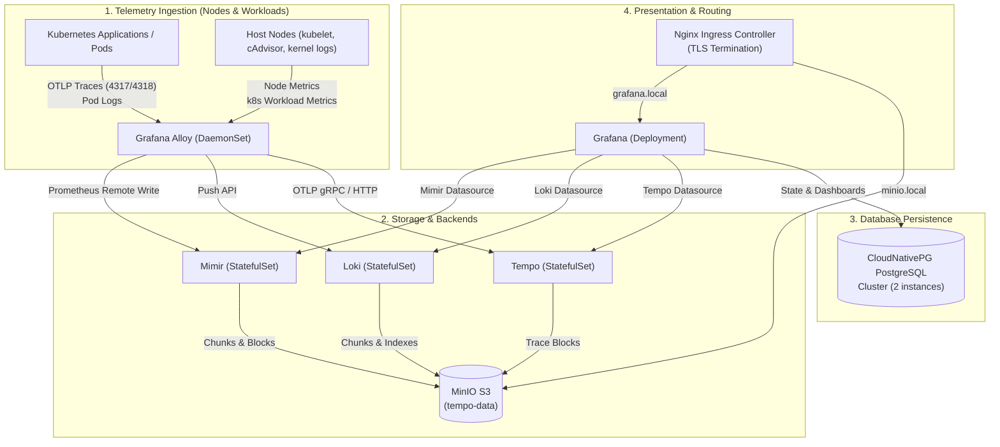

# LGTM-Stack Helm Chart

[](LICENSE)
[](https://kubernetes.io/)
[](https://helm.sh/)

A production-ready, cloud-native observability stack for Kubernetes packaged as a single unified Helm chart. It brings together metrics, logs, distributed tracing, continuous telemetry collection, dashboards, database persistence, and local S3-compatible object storage.

---

## Stack Components

| Component | Role | Kubernetes Resource | Default Image | Ports |
| :--- | :--- | :--- | :--- | :--- |
| **Grafana** | Visualization & Dashboards | `Deployment` (1 replica) | `grafana/grafana:13.1.0` | `3000` (HTTP) |
| **Mimir** | Long-term Prometheus Metrics | `StatefulSet` (2 replicas) | `grafana/mimir:3.2.0` | `9009` (HTTP) |
| **Loki** | Distributed Log Aggregation | `StatefulSet` (2 replicas) | `grafana/loki:3.7.6` | `3100` (HTTP), `9095` (gRPC), `7946` (Memberlist) |
| **Tempo** | Distributed Tracing Backend | `StatefulSet` (2 replicas) | `grafana/tempo:2.10.8` | `3200` (HTTP), `4317` (OTLP gRPC), `4318` (OTLP HTTP) |
| **Alloy** | Telemetry Collector & Agent | `DaemonSet` (1 per node) | `grafana/alloy:v1.18.1` | `12345` (Admin), `4317` (OTLP gRPC), `4318` (OTLP HTTP) |
| **MinIO** | S3-compatible Object Storage | `StatefulSet` (1 replica) | `minio/minio:RELEASE.2024-01-18T22-51-28Z` | `9000` (S3 API), `9001` (Console) |
| **PostgreSQL** | Grafana Session & State DB | `CloudNativePG Cluster` (2 instances) | Managed by CNPG | `5432` (PostgreSQL) |

---

## Architecture & Data Flow



---

## Dependencies & Prerequisites

Before deploying this chart, ensure the following prerequisites are met in your Kubernetes cluster:

1. **Kubernetes Version**: `v1.24+`
2. **Helm Version**: `v3.8+`
3. **CloudNativePG Operator**: 
   The chart provisions a CloudNativePG `Cluster` resource for PostgreSQL persistence, but requires the CloudNativePG operator and its CRDs to be pre-installed in your cluster:
   ```bash
   kubectl apply --server-side -f https://raw.githubusercontent.com/cloudnative-pg/cloudnative-pg/main/releases/cnpg-1.22.1.yaml
   ```
4. **Nginx Ingress Controller**: 
   Required for external access and host-based routing (`grafana.local`, `minio.local`).
5. **StorageClass**: 
   Defaults to `longhorn-1replica`. You can override this with any existing StorageClass (e.g. `gp3`, `standard`, `local-path`) via `values.yaml`.
6. **Local DNS Resolution**:
   For local/lab testing, map the configured ingress hosts to your Ingress controller's external IP in `/etc/hosts` (Linux/macOS) or `C:\Windows\System32\drivers\etc\hosts` (Windows):
   ```text
   <INGRESS_CONTROLLER_IP>  grafana.local minio.local
   ```

---

## Running Process & Lifecycle

When installing or upgrading the Helm chart, the following sequential process takes place:

```text
[1. Chart Installation]
   │
   ├──► [Helm Hook Job: minio-create-bucket]
   │       └── Initializes MinIO and automatically provisions:
   │             - loki-data
   │             - mimir-data
   │             - tempo-data
   │
   ├──► [CloudNativePG Cluster Resource]
   │       └── CNPG Operator reconciles PostgreSQL instances and creates internal RW/RO services.
   │
   ├──► [StatefulSets Provisioning]
   │       └── MinIO, Mimir, Loki, and Tempo claim PVC storage and connect to object storage.
   │
   ├──► [Alloy DaemonSet Deployment]
   │       └── Runs on every node:
   │             - Tails Kubernetes pod logs from /var/log/pods
   │             - Discovers annotated pods and Prometheus endpoints
   │             - Listens on 4317/4318 for app traces and forwards to Tempo
   │
   ├──► [Grafana Deployment & ConfigMaps]
   │       └── Auto-configures:
   │             - Mimir, Loki, Tempo datasources
   │             - Pre-loaded Dashboards from dashboards/ folder
   │             - Connection to CloudNativePG PostgreSQL
   │
   └──► [Ingress & TLS Secrets]
           └── Exposes Grafana and MinIO Console via Nginx Ingress.
```

---

## Pre-Packaged Dashboards

Grafana is provisioned with out-of-the-box dashboards mounted via ConfigMaps from the `dashboards/` directory:

1. **Platform Observability Overview (`dashboards/platform-observability-overview-v1.json`)**: High-level platform health, aggregate ingestion rates, and service availability.
2. **Kubernetes Cluster Overview (`dashboards/k8s-cluster-overview-v1.json`)**: Cluster-wide CPU, memory, filesystem, and network utilization.
3. **Kubernetes Node Infrastructure (`dashboards/k8s-node-infra-v1.json`)**: Detailed per-node compute, disk I/O, pressure stalls, and container runtimes.
4. **Kubernetes Workload Health (`dashboards/k8s-workload-health-v1.json`)**: Pod restarts, OOMKilled events, CPU/Memory throttling, and pod status.
5. **Kubernetes Capacity Planning (`dashboards/k8s-capacity-planning-v1.json`)**: Cluster allocation ratios, resource requests vs usage trends, and headroom estimation.
6. **Loki Logs Operations (`dashboards/loki-logs-operations-v1.json`)**: Operational log stream exploration, error frequency, and volume analytics.

---

## Quick Start

### 1. Add and Inspect the Chart

```bash
# Lint the chart
helm lint .

# Preview template rendering
helm template test-release . -f values.yaml
```

### 2. Install the Chart

```bash
# Create namespace and install
helm install monitoring-stack . \
  --namespace monitoring \
  --create-namespace
```

### 3. Verify Deployment

```bash
# Check all running pods
kubectl get pods -n monitoring

# Check services and ingress
kubectl get svc,ingress -n monitoring

# Check CloudNativePG cluster status
kubectl get cluster.postgresql.cnpg.io -n monitoring
```

---

## Configuration Reference

The following table lists the configurable parameters in `values.yaml`:

### Common & TLS Settings

| Parameter | Description | Default |
| :--- | :--- | :--- |
| `tls.enabled` | Enable unified TLS secret generation | `true` |
| `tls.autoGenerateSecret` | Automatically create Secret from `cert` and `key` | `true` |
| `tls.secretName` | Name of the Kubernetes TLS secret | `"monitoring-tls-secret"` |
| `tls.cert` | Public certificate chain in PEM format | `""` |
| `tls.key` | Private key in PEM format | `""` |

### MinIO Object Storage

| Parameter | Description | Default |
| :--- | :--- | :--- |
| `minio.image.repository` | MinIO container image | `"minio/minio"` |
| `minio.image.tag` | MinIO image tag | `"RELEASE.2024-01-18T22-51-28Z"` |
| `minio.replicas` | Number of MinIO replicas | `1` |
| `minio.accessKeyId` | Root admin access key ID | `"admin"` |
| `minio.secretAccessKey` | Root admin secret access key | `"admin123"` |
| `minio.persistence.storageClassName` | StorageClass for MinIO data | `"longhorn-1replica"` |
| `minio.persistence.size` | PVC size for MinIO | `"1Gi"` |
| `minio.ingress.enabled` | Enable Ingress for MinIO Web Console | `true` |
| `minio.ingress.host` | Hostname for MinIO Console | `"minio.local"` |

### Loki (Logs)

| Parameter | Description | Default |
| :--- | :--- | :--- |
| `loki.image.repository` | Loki container image | `"grafana/loki"` |
| `loki.image.tag` | Loki image tag | `"3.7.6"` |
| `loki.replicas` | Number of Loki cluster replicas | `2` |
| `loki.s3.bucketName` | S3 bucket for Loki chunks/indexes | `"loki-data"` |
| `loki.pvc.storageClassName` | StorageClass for Loki PVC | `"longhorn-1replica"` |
| `loki.pvc.size` | Storage volume size per replica | `"1Gi"` |

### Mimir (Metrics)

| Parameter | Description | Default |
| :--- | :--- | :--- |
| `mimir.image.repository` | Mimir container image | `"grafana/mimir"` |
| `mimir.image.tag` | Mimir image tag | `"3.2.0"` |
| `mimir.replicas` | Number of Mimir cluster replicas | `2` |
| `mimir.s3.bucketName` | S3 bucket for metric blocks | `"mimir-data"` |
| `mimir.pvc.storageClassName` | StorageClass for Mimir PVC | `"longhorn-1replica"` |
| `mimir.pvc.size` | Storage volume size per replica | `"1Gi"` |

### Tempo (Traces)

| Parameter | Description | Default |
| :--- | :--- | :--- |
| `tempo.image.repository` | Tempo container image | `"grafana/tempo"` |
| `tempo.image.tag` | Tempo image tag | `"2.10.8"` |
| `tempo.replicas` | Number of Tempo cluster replicas | `2` |
| `tempo.s3.bucketName` | S3 bucket for trace data | `"tempo-data"` |
| `tempo.storage.className` | StorageClass for Tempo PVC | `"longhorn-1replica"` |
| `tempo.storage.size` | Storage volume size per replica | `"1Gi"` |

### Alloy (Collector)

| Parameter | Description | Default |
| :--- | :--- | :--- |
| `alloy.image.repository` | Alloy container image repository | `"grafana/alloy"` |
| `alloy.image.tag` | Alloy image tag | `"v1.18.1"` |
| `alloy.image.pullPolicy` | Image pull policy | `"IfNotPresent"` |

### Grafana & Database

| Parameter | Description | Default |
| :--- | :--- | :--- |
| `grafana.replicas` | Grafana deployment replicas | `1` |
| `grafana.image.repository` | Grafana container image | `"grafana/grafana"` |
| `grafana.image.tag` | Grafana container image tag | `"13.1.0"` |
| `grafana.adminUser` | Initial admin account username | `"admin"` |
| `grafana.adminPassword` | Initial admin account password | `"admin123"` |
| `grafana.ingress.host` | Ingress hostname for Grafana | `"grafana.local"` |
| `database.clusterName` | CloudNativePG cluster name | `"grafana-db-cluster"` |
| `database.instances` | PostgreSQL replica instances | `2` |
| `database.storageSize` | Storage volume size per PostgreSQL node | `"1Gi"` |
| `database.storageClassName` | StorageClass for PostgreSQL | `"longhorn-1replica"` |

---

## Security & Best Practices

> [!WARNING]
> The default credentials in `values.yaml` (`admin123`) are provided for testing and demonstration only.

For production or shared environments:
1. Provide custom values via an external secrets file or override parameters using `--set`:
   ```bash
   helm upgrade --install monitoring-stack . \
     -n monitoring \
     -f values.production.yaml
   ```
2. Disable `tls.autoGenerateSecret` and reference a cert-manager managed TLS secret using `tls.secretName`.

---

## License

This project is licensed under the Apache 2.0 License - see the [LICENSE](LICENSE) file for details.
