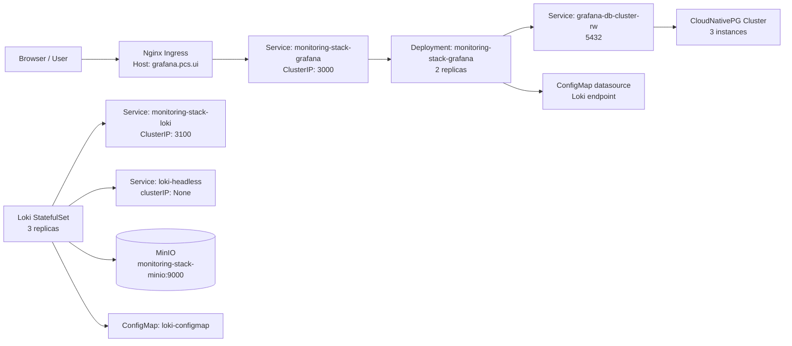

# Monitoring Stack

This Helm chart deploys a lightweight monitoring stack for Kubernetes with:

- Grafana for dashboards and visualization
- Loki for logs
- CloudNativePG for the Grafana database
- S3-compatible object storage for Loki index and chunks
- Traefik ingress for Grafana access

The stack is designed for a local or lab Kubernetes environment and is configured for simple internal routing and local service discovery.

## Architecture



## Components

### 1. Grafana

The Grafana deployment is created from the chart and exposes a web UI through Nginx.

- Deployment: `monitoring-stack-grafana`
- Replicas: 2
- Service: `monitoring-stack-grafana`
- Port: `3000`
- Ingress host: `grafana.pcs.ui`
- Default credentials: user `admin`, password `admin123`

Grafana is configured to connect to the PostgreSQL database via the CloudNativePG RW service and the Loki datasource for logs.

### 2. PostgreSQL / CloudNativePG

A PostgreSQL cluster is created with CloudNativePG for Grafana persistence.

- Cluster name: `grafana-db-cluster`
- Database: `grafana`
- User: `grafana`
- Secret: `monitoring-stack-grafana-db-credentials`
- Instances: 3
- Storage: `5Gi` using `longhorn`

The database is exposed internally through the generated CNPG services:

- `grafana-db-cluster-rw` for writes
- `grafana-db-cluster-r`
- `grafana-db-cluster-ro`

### 3. Loki

Loki is deployed as a StatefulSet with replication for log storage and clustering.

- StatefulSet: `loki`
- Replicas: 3
- StatefulSet service name: `loki-headless`
- Service: `monitoring-stack-loki` (ClusterIP)
- Port: `3100` for HTTP, `9095` for gRPC
- Memberlist port: `7946`

The Loki config uses a `ConfigMap` and reads S3 credentials from a Kubernetes Secret. Loki writes data to an S3-compatible object store using the configured endpoint and bucket name.

### 4. MinIO object storage

Loki is configured to use the in-cluster MinIO service as its S3-compatible backend for logs.

- Endpoint: `monitoring-stack-minio:9000`
- Bucket: `loki-data`
- Credentials are stored in the `monitoring-stack-loki-secret` Secret

This provides persistent log storage outside the pod filesystem.

### 5. Ingress and routing

Grafana is exposed by Nginx through an Ingress resource.

#### Route

```text
Browser --> grafana.pcs.ui --> Nginx Ingress --> Service: monitoring-stack-grafana --> Grafana Pod
```

This is configured in the chart with:

- Ingress class: `nginx`
- Host: `grafana.pcs.ui`
- Path: `/`
- Backend: `monitoring-stack-grafana:3000`

Loki is exposed separately through its internal ClusterIP service at `monitoring-stack-loki:3100`.

## Internal service flow

### Grafana request flow

```text
HTTP request
  -> Traefik ingress
  -> monitoring-stack-grafana Service
  -> Grafana Deployment pod
  -> PostgreSQL Cluster (through grafana-db-cluster-rw)
  -> Grafana database
```

### Loki log flow

```text
Application / logs
  -> Loki pod (collector/ingester)
  -> Loki config and storage settings
  -> S3-compatible object store
```

### Grafana datasource flow

Grafana uses a ConfigMap to configure a Loki datasource.

```text
Grafana UI
  -> datasource config
  -> Loki service
  -> Loki HTTP endpoint: http://loki.<namespace>.svc.cluster.local:3100
```

## Helm values

The chart is parameterized through the root `values.yaml` file.

Key values include:

- `loki.replicas`
- `loki.serviceName`
- `loki.servicePort`
- `loki.s3.bucketName`
- `database.clusterName`
- `database.instances`
- `database.storageSize`
- `grafana.ingress.host`
- `grafana.replicas`

## Deployment

Install or upgrade the stack with:

```bash
helm upgrade --install monitoring-stack . -n monitoring --create-namespace
```

Verify the resources:

```bash
kubectl get pods -n monitoring
kubectl get svc -n monitoring
kubectl get ingress -n monitoring
kubectl get statefulset -n monitoring
```

## Notes

- The Grafana app is served at `grafana.pcs.ui` through the Nginx ingress.
- Loki is available internally at `monitoring-stack-loki:3100` and does not use the Grafana ingress path.
- The database is internal to the cluster and is not exposed directly outside Kubernetes.
- S3 credentials and database credentials are managed through Kubernetes Secrets.

## Summary

This stack provides a practical local observability environment:

- Grafana for UI and dashboards
- Loki for log aggregation
- CNPG for Grafana persistence
- S3-compatible storage for long-term log retention
- Ingress-driven access for the Grafana frontend

This gives a simple path from local development or lab deployment to a working monitoring environment with minimal operational overhead.
